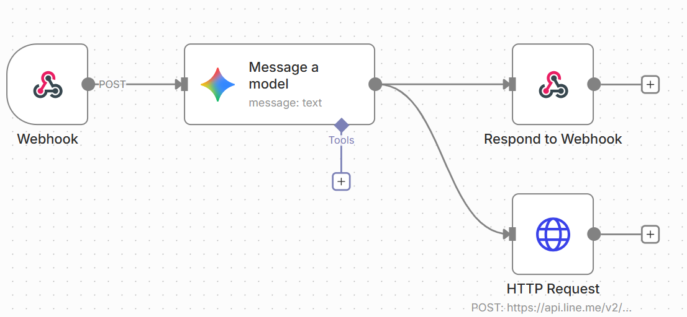

# Generative AI MBTI Agent Workflow

這個專案示範如何運用 n8n、Google Gemini 以及 LINE Messaging API，打造一個能即時回覆使用者並同步發送通知的生成式 AI 自動化代理。前端部署於 [`https://n8nmbtiai.vercel.app/`](https://n8nmbtiai.vercel.app/)，使用者可以在頁面上填寫 MBTI 問卷，並透過 n8n 的工作流獲得個人化的性格分析。

---

## 系統架構概覽

- **前端 (Vercel)**：提供問卷介面，收集使用者姓名與 MBTI 問題答案，並發送 HTTP POST 至 n8n Webhook。
- **工作流引擎 (n8n)**：以可視化節點串接資料流程，負責接收請求、呼叫生成式 AI，以及在多路徑間傳遞 JSON 資料。
- **生成式 AI (Google Gemini)**：根據預先撰寫的 Prompt 與使用者輸入，產生心理分析文字。
- **通知服務 (LINE Messaging API)**：接收 n8n 主動送出的 POST，將分析結果推播至管理者 LINE 帳號。

---

## 工作流詳細說明

1. **觸發階段：Webhook 接收資料**  
   - 節點：`Webhook`  
   - 前端問卷送出後，瀏覽器發送含有 JSON 內容的 HTTP POST（例如 `{ "name": "小林", "q1": "E", "q2": "T" }`）。  
   - n8n 接收到請求後啟動整個流程，Webhook 連線維持掛起狀態，等待回應。

2. **智慧處理階段：Message a Model (Google Gemini)**  
   - n8n 將 Webhook 的輸入資料嵌入預先設計的 Prompt，並呼叫 Google Gemini API。  
   - Gemini 進行語意理解與性格分析，回傳一段量身訂製的回覆（例如：「你是天生的指揮官 ENTJ...」）。

3. **分流階段：平行執行**  
   - Gemini 節點的輸出同時流向兩條路徑，讓回應與通知並行處理，互不阻塞。

4. **路徑 A：回應前端**  
   - 節點：`Respond to Webhook`  
   - 將 AI 生成的資訊封裝為 JSON，回傳給原始 HTTP 連線，完成請求-回應循環。  
   - 前端接收資料後更新 UI，顯示分析結果給使用者。

5. **路徑 B：推播 LINE 通知**  
   - 節點：`HTTP Request`（POST 至 `https://api.line.me/v2/...`）  
   - n8n 主動將使用者姓名與分析文字組合成符合 LINE Messaging API 規格的訊息。  
   - LINE 伺服器推播訊息至管理者手機，達成即時監控使用情形。

---

## n8n 技術原理解析

- **節點式編程 (Node-Based Visual Programming)**：n8n 透過可視化節點封裝底層程式碼，我們只需拖拉節點與設定參數即可描述業務邏輯。每個節點就像一個微服務，負責單一職責。
- **JSON 資料流**：節點之間透過 JSON 物件傳遞資訊；上一節點輸出的 JSON 會自動成為下一節點輸入，讓欄位映射與條件判斷更直覺。
- **Webhook 同步請求/回應**：Webhook 節點保持連線直到 `Respond to Webhook` 節點完成回傳，確保前端不會逾時並且拿到 AI 結果。
- **API 整合與互操作性**：n8n 以標準 HTTP/REST 介面串接 Vercel、Google Gemini 與 LINE，扮演跨系統資料交換的膠水。

---

## 部署與設定重點

- **環境變數**  
  - `GEMINI_API_KEY`：Google Gemini API 金鑰，用於 Message a Model 節點。  
  - `LINE_CHANNEL_ACCESS_TOKEN`：LINE Messaging API 權杖，供 HTTP Request 節點授權。  
  - `LINE_USER_ID` 或 `LINE_GROUP_ID`：推播目標。

- **安全性建議**  
  - 在 n8n 中使用加密憑證或專用憑證管理功能存放密鑰。  
  - 若公開 Webhook，建議於前端加入簽章或密碼驗證，防止未授權請求濫用。

- **部署建議**  
  - Vercel 前端可使用 `.env` 存放 API 端點與鑰匙。  
  - n8n 可部署於自家伺服器、雲端 VM 或 n8n cloud，確保 HTTPS 與可用性。  
  - LINE Messaging API 需在 LINE Developers 後台設定 Webhook URL 與對象。

---

## 測試流程

1. 於 Vercel 頁面填入測試姓名與問卷答案並送出。  
2. 確認前端得到 AI 文字回覆並顯示。  
3. 在 LINE 當中檢查是否收到相同內容的推播。  
4. 於 n8n 執行紀錄中確認各節點狀態，確保未出現錯誤。

---

## 可延伸方向

- 加入 n8n `If` 或 `Switch` 節點，針對不同 MBTI 結果推播不同模板。  
- 增加資料庫節點（如 Airtable、Supabase）紀錄歷史測試資料。  
- 將 LINE 通知改為 Carousel 或 Flex Message，提升視覺呈現。  
- 將 Gemini 回覆加上語音合成或多語系翻譯，提高可用性。

---

## 參考與致謝

- 工作流靈感與設定方式參考了 [soluckysummer/n8n_workflows](https://github.com/soluckysummer/n8n_workflows/tree/main)。

如需更多說明，可在 n8n 的執行記錄中檢視每個節點的入出資料，或進一步撰寫測試腳本確保流程穩定。
